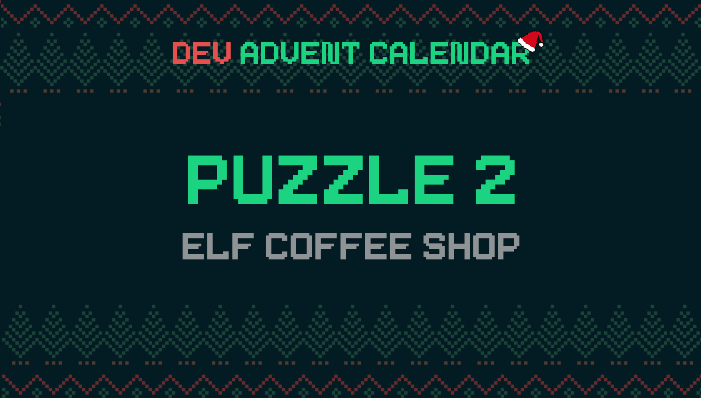

ℹ️ For detailed information about the contest, check out [devadvent/readme](https://github.com/devadvent/readme/)

# Dev Advent Calendar 🎅 Puzzle 2 - Elf Coffee Shop 🧝🥤

The Elf Coffee Shop has its big reopening after lengthy renovation works during the summer. Not only is it completely modernized, but has also a whole new range of available drinks.
In the old coffee shop, the elves could only choose between "Hot Chocolate" and "Coffee". This new coffee shop has a list of various drinks (e.g. `Latte`, `Hot Chocolate`, etc.) and optional flavors (e.g. `Gingerbread`, `Peppermint`, etc.).

Since this is new and confusing to the elves, especially because the pricing is a bit more complicated than before, the owner of Elf Coffee Shop asked if you could create an automated menu.
He would provide you with the name/price of each drink, and the name/price of each available flavor.

It now is your job to create a list of all possible combinations of these drinks (including those without extra flavor), and the pricing.

## 🧩 The puzzle

The drinks (`drinks`) and special flavors (`flavors`) can be found in the [data/drinks.js](data/drinks.js) file and are similar to this:

```javascript
const drinks = [
    { name: 'Latte', price: 3 },
    { name: 'Hot Chocolate', price: 4.5 },
    ...
]
const flavors = [
    { name: 'Ginerbread', price: 1.5 },
    { name: 'Cinnamon', price: 1 },
    ...
]
```

-   Complete the function `createMenu` in the file [utils/menu.js](utils/menu.js), returning an array of all available drinks including prices (See [example result](#example-result) for further aclaration)
-   Each item in the array should have `drink`, `flavor`, and `price`
-   `price` is the total price of drink price + flavor price
-   Each drink base should also be available as "plain", without extra flavor. This should be represented with flavor: `undefined`
-   The menu should be sorted first by drink name, then by price.

## Example result

An example result could look like this:

```javascript
const result = [
    { drink: 'Latte', flavor: undefined, price: 3 },
    { drink: 'Latte', flavor: 'Cinnamon', price: 4 },
    { drink: 'Latte', flavor: 'Peppermint', price: 5 },
    { drink: 'Macchiato', flavor: undefined, price: 10 },
    { drink: 'Macchiato', flavor: 'Cinnamon', price: 11 },
    { drink: 'Macchiato', flavor: 'Peppermint', price: 12 },
]
```

## 🚢 Ship your solution

Check out the [contributing guide](https://github.com/devadvent/readme/blob/main/CONTRIBUTING.md) for details about how to participate.

In short:

-   ✨ Create your repository by [acceping the assignment](https://classroom.github.com/a/A7gW5-t3) using the participation link
-   🧩 Solve the puzzle
-   🐦 Add your Twitter handle to `twitter.js`
-   🤖 Test your solution
-   🚀 Upload your changes to the `main` branch

## 🔗 Participation link

In order to participate, you need to enter the following link and accept the assignment:
[https://classroom.github.com/a/A7gW5-t3](https://classroom.github.com/a/A7gW5-t3)

## 💻 Use this project

### ⏳ Install the dependencies

Install the dependencies with

```bash
yarn install
```

or

```bash
npm install
```

### ⚙️ Run the code

Run the code with

```bash
yarn dev
```

or

```bash
npm run dev
```

### 🤖 Test your solution

This puzzle is equipped with automated tests (in the `./tests` folder). In order for your solution to qualify for winning the daily prize, **all** tests need to pass.

To run these tests, execute one of the following commands in your console:

```bash
yarn test
```

or

```bash
npm test
```
